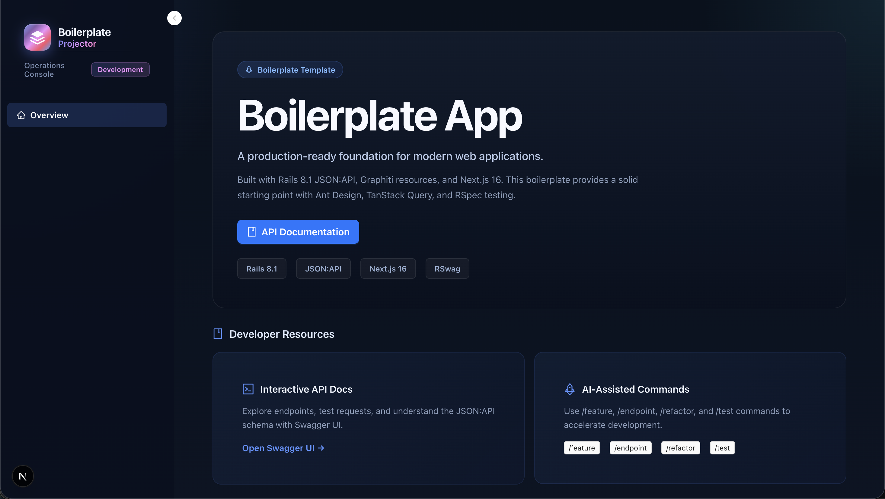

# Full-Stack Monorepo – Rails 8.1 + Next.js 16

A **Rails 8.1 JSON:API** backend paired with a modern **Next.js 16** frontend, managed as a pnpm monorepo.
This boilerplate demonstrates production-ready full-stack development practices with manual JSON:API serialization, Graphiti resources, and comprehensive testing.



## 📋 Project Overview

### Backend (Rails)
- **Ruby**: 3.2.2
- **Rails**: 8.1
- **Database**: SQLite3 (development/test) · PostgreSQL (production-ready)
- **Pagination**: [Pagy](https://github.com/ddnexus/pagy) (default 20 items, max 100)
- **API Documentation**: [RSwag](https://github.com/rswag/rswag) (OpenAPI 3.0)
- **Serialization**: Manual JSON:API via `BaseController` concerns + Graphiti resource introspection
- **Testing**: RSpec with RSwag contract specs and Graphiti resource specs
- **Authentication**: [Warden](https://github.com/hassox/warden) (placeholder implementation)
- **Authorization**: [Pundit](https://github.com/varvet/pundit) (policy-based authorization)
- **Soft Deletion**: [Paranoia](https://github.com/railsware/paranoia) (soft delete for all models)
- **Structured Logging**: [Lograge](https://github.com/roidrage/lograge) (JSON logs in production)
- **N+1 Detection**: [Bullet](https://github.com/flyerhzm/bullet) (development query analysis)
- **Error Pages**: [Better Errors](https://github.com/BetterErrors/better_errors) (enhanced dev error pages)

### Frontend (Next.js)
- **Framework**: Next.js 16 (App Router) with React 19
- **UI Library**: Ant Design 5.x + ProComponents
- **Forms**: `@rjsf/antd` – schema‑driven from OpenAPI
- **Server State**: TanStack Query v5 – all API calls go through generated hooks
- **Client State**: Zustand – **only** for theme and sidebar state
- **HTTP Client**: `@hey-api/openapi-ts` generated SDK
- **Testing**: Vitest (unit/component) + Playwright (E2E)

### AI Governance
- **Tool**: [AI-Rulez](https://github.com/Goldziher/ai-rulez) – unified rules and commands for Claude, Cursor, Windsurf, Copilot, and more.

## 🚀 Quick Start

### Prerequisites
- **Ruby**: 3.2.2
- **SQLite3**: (for development/testing)
- **Node.js**: 18+ (for frontend)
- **pnpm**: 8+ (package manager)

### 1. Backend (Rails)
```bash
cd backend
bundle install

# Create database (SQLite3 for dev/test)
rails db:create

# Run migrations
rails db:migrate

# (Optional) Seed data
rails db:seed

# Verify everything works
bundle exec rspec spec

# Start server
rails server            # runs on http://localhost:3000
```

API available at `http://localhost:3000/api/v1/`  
Interactive docs at `http://localhost:3000/api-docs`

### 2. Frontend (Next.js)
```bash
cd frontend
pnpm install
pnpm generate:api      # pulls OpenAPI spec from Rails and generates SDK
pnpm dev               # runs on http://localhost:3001
```

### 3. Full‑Stack Development
Start both servers at once (Rails on 3000, Next.js on 3001):
```bash
pnpm dev
```
All frontend API calls are proxied to the Rails backend via the generated SDK.

## 🏛️ Architecture at a Glance

| Layer | Technology | Purpose |
|-------|------------|---------|
| **Backend Controllers** | `BaseController` + concerns | Reusable CRUD, JSON:API serialization, pagination, error handling |
| **Backend Resources** | Graphiti | Schema introspection (attributes, types, writable flags) – *not full responders* |
| **Backend Pagination** | Pagy | Consistent `meta` in index responses |
| **Backend Testing** | RSwag (contract), RSpec (unit) | OpenAPI spec auto‑generation + business logic coverage |
| **Backend Docs** | Swagger UI | Served at `/api-docs` from `public/api-docs/v1/openapi.json` |
| **Frontend Framework** | Next.js 16 (App Router) | Server‑side rendering, routing, API routes |
| **Frontend UI** | Ant Design + ProComponents | Professional admin interface with dark theme |
| **Frontend Forms** | @rjsf/antd | Fully schema‑driven from OpenAPI definitions |
| **Frontend State** | TanStack Query + Zustand | Server cache in Query, UI state (theme/sidebar) in Zustand |
| **Frontend Testing** | Vitest + Playwright | Unit/component + E2E coverage |

## 🔐 Foundational Gems

### Authentication (Warden)
- **Purpose**: Rack-based authentication middleware
- **Current State**: Placeholder implementation in `config/initializers/warden.rb`
- **Usage**: `current_user` returns `nil` (backward compatible)

### Authorization (Pundit)
- **Purpose**: Policy-based authorization
- **Current State**: All policies return `true` for all actions (backward compatible)
- **Usage**: Policies in `app/policies/`

### Soft Deletion (Paranoia)
- **Purpose**: Soft delete records instead of permanent deletion
- **Current State**: All models have `acts_as_paranoid` and `deleted_at` columns
- **Usage**: `destroy` sets `deleted_at`. Access with `Model.unscoped` to include deleted records.

### Structured Logging (Lograge)
- **Purpose**: Single-line JSON logs for production
- **Configuration**: Enabled in `config/environments/production.rb`

### N+1 Query Detection (Bullet)
- **Purpose**: Detect N+1 query performance issues
- **Configuration**: Enabled in `development.rb` (logs) and `test.rb` (raises errors)

### Error Pages (Better Errors)
- **Purpose**: Enhanced error pages in development
- **Configuration**: Enabled in `development` group in Gemfile

## 🧪 Testing

### Backend (Rails)
```bash
cd backend
# All tests (fast, excludes RSwag specs)
bundle exec rspec --exclude-pattern "spec/requests/**/*_swagger_spec.rb"

# Only RSwag contract tests
bundle exec rspec spec/requests/api/v1/

# Regenerate OpenAPI spec after changing RSwag tests
bundle exec rake rswag:specs:swaggerize
```

### Frontend (Next.js)
```bash
cd frontend
# Run unit/component tests
pnpm test

# Run tests with UI
pnpm test:ui

# Run E2E tests (Playwright)
pnpm test:e2e

# Type checking
pnpm typecheck

# Linting
pnpm lint

# Format code
pnpm format
```

## 📜 Available Scripts

### Root (Monorepo)
| Script | Description |
|--------|-------------|
| `pnpm dev` | Start both Rails (port 3000) and Next.js (port 3001) servers concurrently |
| `pnpm test` | Run both backend and frontend tests concurrently |
| `pnpm lint` | Run both backend and frontend linters concurrently |
| `pnpm build` | Generate OpenAPI spec, regenerate frontend SDK, build frontend |
| `pnpm rules:generate` | Regenerate AI‑Rulez configs for all assistants |
| `pnpm rules:watch` | Watch `.ai-rulez/` and auto‑regenerate on changes |
| `pnpm prepare` | Runs `rules:generate` + installs Husky hooks |

### Backend (via root)
| Script | Description |
|--------|-------------|
| `pnpm backend:dev` | Start Rails server on port 3000 |
| `pnpm backend:test` | Run RSpec tests |
| `pnpm backend:rubocop` | Run RuboCop linting |
| `pnpm backend:rubocop:autocorrect` | Auto-correct RuboCop offenses |
| `pnpm backend:generate:openapi` | Regenerate OpenAPI spec from RSwag specs |
| `pnpm backend:validate:openapi` | Validate OpenAPI spec |

### Frontend (via root)
| Script | Description |
|--------|-------------|
| `pnpm frontend:dev` | Start Next.js dev server on port 3001 |
| `pnpm frontend:build` | Build for production |
| `pnpm frontend:lint` | Run ESLint |
| `pnpm frontend:typecheck` | Run TypeScript compiler (no emit) |
| `pnpm frontend:test` | Run Vitest unit/component tests |
| `pnpm frontend:format` | Format all code with Prettier |
| `pnpm frontend:generate:api` | Pull OpenAPI spec from Rails and regenerate TypeScript SDK |

## 🤖 AI Assistant Commands (via AI-Rulez)

This project includes pre‑configured slash commands that work across Claude, Cursor, Windsurf, and Copilot. All configuration lives in `.ai-rulez/`.

| Command | What it does | Example Prompt |
|---------|--------------|----------------|
| `/feature` | TDD workflow for a new JSON:API feature with orchestrator pattern | `/feature Add a Task resource with name, due_date, and completed_at fields` |
| `/endpoint` | Add a new RESTful endpoint (route → resource → orchestrator → controller → spec) | `/endpoint POST /api/v1/projects/:id/archive` |
| `/refactor` | Improve code without changing behavior | `/refactor app/controllers/api/v1/companies_controller.rb` |
| `/test` | Run RSpec tests (including RSwag) and help debug failures | `/test spec/requests/api/v1/projects_spec.rb` |
| `/fix-n+1` | Detect and fix N+1 queries in paginated endpoints | `/fix-n+1 app/controllers/api/v1/tasks_controller.rb` |
| `/security` | Audit for mass assignment, SQL injection, etc. | `/security app/controllers/api/v1/base_controller.rb` |
| `/explain` | Explain a piece of code in plain English | `/explain app/controllers/concerns/api/v1/jsonapi_serialization.rb` |
| `/frontend-feature` | Implement a new frontend feature following SOLID principles | `/frontend-feature Add a Comment resource with form and table` |
| `/frontend-refactor` | Refactor frontend code – improve structure or performance | `/frontend-refactor src/components/ResourceTable/index.tsx` |
| `/generate-api` | Regenerate TypeScript SDK from Rails OpenAPI spec | `/generate-api` |
| `/migration` | Create a safe, reversible database migration | `/migration add status column to projects` |
| `/rubocop` | Run RuboCop and auto-correct safe offenses | `/rubocop app/controllers/` |
| `/service` | Extract logic into orchestrator action or standalone service object | `/service company creation validation` |
| `/red` | Write a failing RSwag or RSpec test (TDD) | `/red POST /api/v1/projects/:id/archive returns 200` |

## 🔧 Git Hooks

Husky + lint‑staged are configured in the root to run:
- RuboCop on staged Ruby files
- OpenAPI spec validation
- Auto‑regenerate OpenAPI spec when RSwag files change
- Frontend: ESLint, Prettier, and type checking

Install with:
```bash
pnpm install   # from the root
```

## 📁 Key Directories

```
.
├── backend/                       # Rails backend
│   ├── app/
│   │   ├── controllers/api/v1/   # API endpoints (inherit from BaseController)
│   │   ├── controllers/concerns/api/v1/ # JsonapiActions, PagySupport, etc.
│   │   ├── models/               # ActiveRecord models
│   │   ├── resources/            # Graphiti resource definitions
│   │   └── services/             # Orchestrators and service objects
│   ├── spec/
│   │   ├── requests/api/v1/      # RSwag contract specs
│   │   ├── resources/            # Graphiti resource specs
│   │   └── swagger_helper.rb     # OpenAPI schema definitions
│   ├── public/api-docs/v1/       # Generated OpenAPI spec
│   └── lib/tasks/                # Rake tasks for OpenAPI generation/validation
├── frontend/                     # Next.js frontend
│   ├── app/                      # App Router pages
│   │   ├── (dashboard)/          # Dashboard route group with layout
│   │   ├── layout.tsx           # Root layout
│   │   └── page.tsx             # Root page
│   ├── src/
│   │   ├── api/generated/        # OpenAPI generated SDK (gitignored)
│   │   ├── components/           # Shared generic components
│   │   │   ├── AppShell/        # Main layout with sidebar navigation
│   │   │   ├── ResourceTable/   # Generic table component
│   │   │   ├── ResourceForm/    # Generic form dialog
│   │   │   └── ResourceWorkspace/ # Generic CRUD workspace
│   │   ├── config/               # Resource metadata and navigation
│   │   ├── features/             # Feature modules with custom hooks
│   │   ├── lib/                  # Utilities
│   │   │   ├── json-api.ts      # JSON:API adapter functions
│   │   │   └── query-client.tsx # TanStack Query configuration
│   │   └── stores/               # Zustand stores (theme, sidebar)
│   └── openapi-ts.config.ts      # OpenAPI generation configuration
├── .ai-rulez/                    # AI governance source of truth
├── .windsurf/workflows/           # Windsurf workflow commands
├── .opencode/                    # OpenCode commands and rules
├── package.json                  # Root package.json (monorepo scripts)
├── pnpm-workspace.yaml           # pnpm monorepo config
└── turbo.json                    # Turborepo pipeline
```

## 📄 License

This project is for development/educational purposes only.
